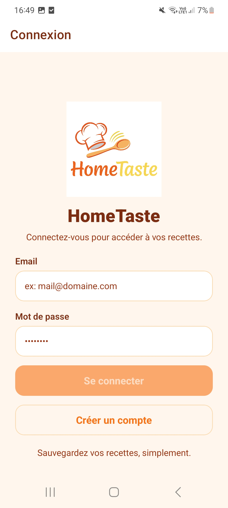
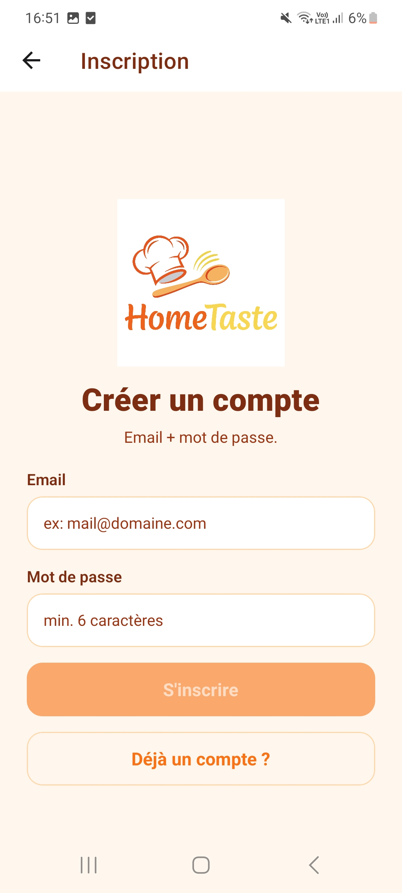
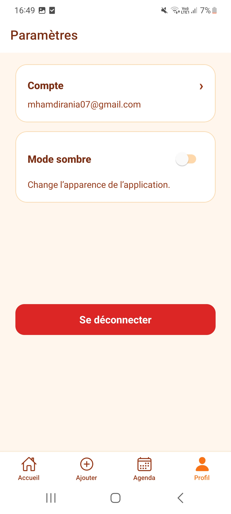
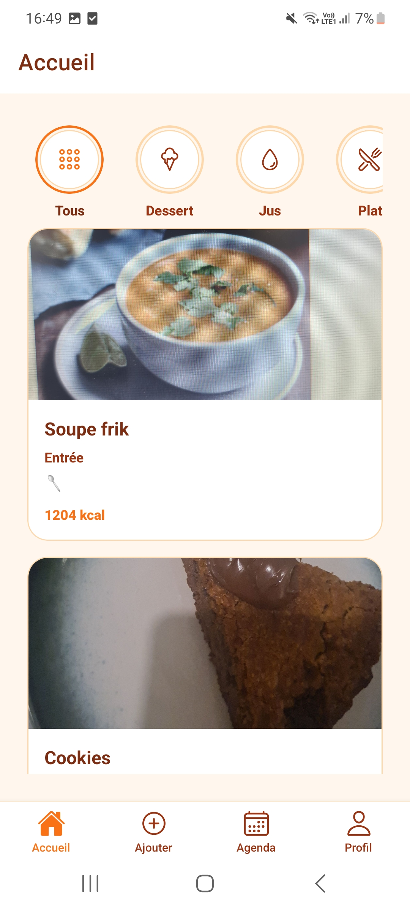
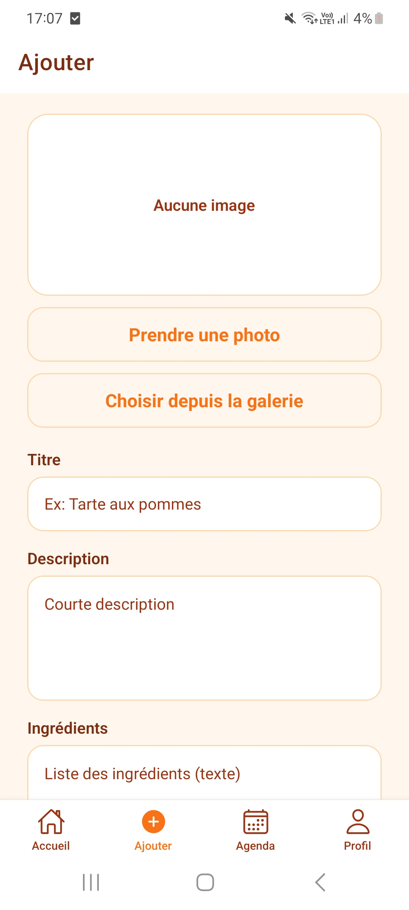
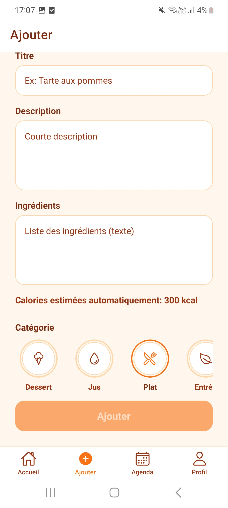
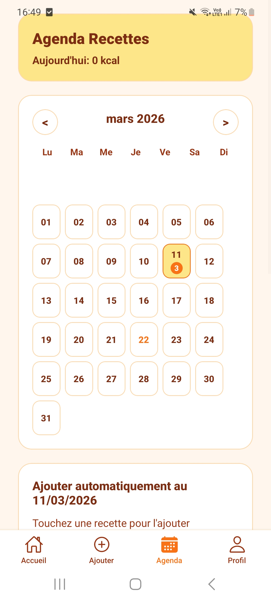
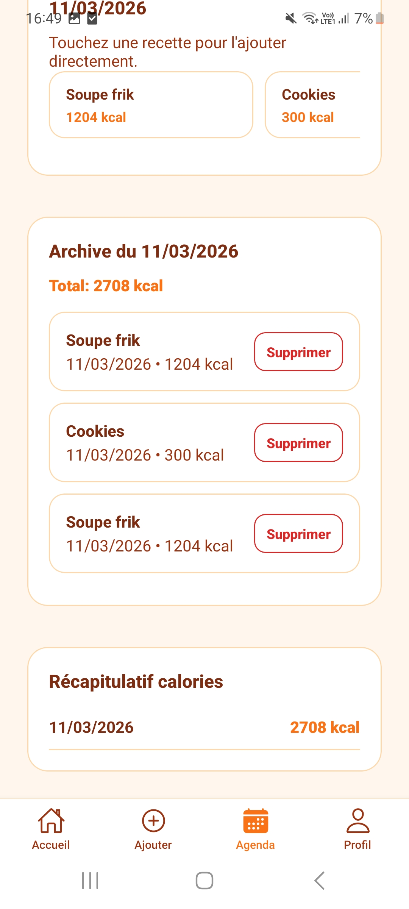
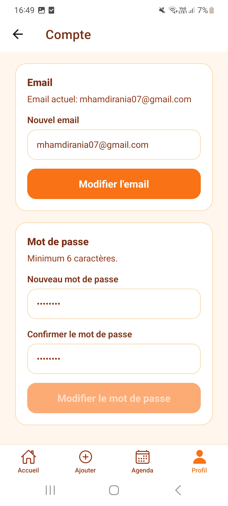

# HomeTaste

Application mobile cross-platform de gestion de recettes de cuisine, développée avec React Native (Expo) et Supabase.

## 1. Présentation du projet

### Description
HomeTaste est une application mobile Android et iOS permettant à un utilisateur de :
- créer un compte et se connecter ;
- ajouter, modifier, supprimer et consulter ses recettes ;
- associer des images à ses recettes via la caméra ou la galerie ;
- organiser ses recettes par catégorie et suivre une estimation calorique.

### Objectif du projet
Ce projet a été conçu dans le cadre d’une évaluation en développement mobile. Il met en avant :
- la maîtrise d’un framework mobile cross-platform ;
- l’intégration d’un backend BaaS (auth + base de données) ;
- la gestion d’interactions natives (caméra, permissions) ;
- une architecture claire et maintenable.

## 2. Choix techniques

### React Native (avec Expo)
React Native a été choisi pour :
- développer une seule base de code pour Android et iOS ;
- accélérer le cycle de développement grâce à Expo (build, run, outils natifs) ;
- bénéficier d’un écosystème mature pour la navigation, le stockage local et l’accès aux APIs natives.

### Supabase (Authentification + Base de données)
Supabase a été retenu pour :
- l’authentification utilisateur (inscription, connexion, session persistante) ;
- la base de données PostgreSQL et les opérations CRUD ;
- le stockage d’images (bucket) ;
- les politiques de sécurité (RLS) adaptées à des données par utilisateur.

## 3. Fonctionnalités

- Authentification complète : inscription, connexion, déconnexion.
- CRUD recettes :
  - création d’une recette ;
  - consultation de la liste et du détail ;
  - modification ;
  - suppression.
- Navigation multi-écrans (stacks + tabs) pour une expérience fluide.
- Données isolées par utilisateur connecté (filtrage par user_id).
- Catégorisation des recettes et estimation calorique basée sur les ingrédients.

## 4. API & gestion des données

### Intégration Supabase
- Auth via Supabase Auth.
- Données recettes via table dédiée.
- Upload image via Supabase Storage.

### Appels asynchrones
Les interactions backend sont gérées en asynchrone avec gestion explicite des états UI :
- loading : affichage pendant les appels réseau ;
- success : mise à jour de l’interface et navigation ;
- error : messages d’erreur contextualisés.

### Résilience des données
- Cache local des recettes via AsyncStorage pour améliorer la robustesse côté mobile.
- Messages d’erreur guidés en cas de schéma/permissions non conformes.

## 5. Fonctionnalité native

### Caméra et galerie
L’ajout d’image de recette prend en charge :
- la prise de photo avec la caméra ;
- la sélection depuis la galerie.

### Gestion des permissions
L’application gère le cycle complet des permissions :
- demande de permission au moment opportun ;
- explication utilisateur en cas de refus ;
- gestion de la non-disponibilité (fallback/alerte).

## 6. Architecture du projet

Organisation principale :

```text
HomeTaste/
├── assets/                # Ressources statiques (images, logo)
├── components/            # Composants UI réutilisables
├── context/               # Contexts globaux (auth, thème)
├── navigation/            # Configuration des stacks/tabs et types
├── screens/               # Écrans applicatifs
├── services/              # Accès API, logique data, intégrations Supabase
├── supabase/              # Scripts SQL de setup/migrations/policies
├── types/                 # Types métier (Recipe, Agenda...)
├── App.tsx                # Point d’entrée applicatif
├── app.json               # Configuration Expo
└── package.json           # Dépendances et scripts
```

Principes appliqués :
- séparation UI / logique / data ;
- composants focalisés et réutilisables ;
- services dédiés aux échanges backend ;
- types centralisés pour sécuriser le développement TypeScript.

## 7. Installation et lancement

### Prérequis
- Node.js LTS
- npm
- Expo CLI (via npx)
- Un projet Supabase actif
- Un appareil Android/iOS avec Expo Go, ou un émulateur

### 1) Cloner et installer
```bash
git clone <url-du-repo>
cd HomeTaste
npm install
```

### 2) Configurer les variables d’environnement
Créer un fichier .env à la racine du projet :

```env
EXPO_PUBLIC_SUPABASE_URL=https://YOUR_PROJECT.supabase.co
EXPO_PUBLIC_SUPABASE_ANON_KEY=YOUR_SUPABASE_ANON_KEY
```

### 3) Initialiser la base Supabase
Exécuter les scripts SQL du dossier supabase/ dans l’ordre recommandé :
1. setup.sql
2. add_category.sql
3. add_calories.sql
4. storage_policies.sql

### 4) Lancer l’application
```bash
npm run start
```

Puis, selon la cible :
```bash
npm run android
npm run ios
npm run web
```

## 8. Captures d’écran


<table align="center">
  <tr>
    <td align="center"><b>Connexion</b><br /><a href="./assets/screen-connexion.jpg"></a></td>
    <td align="center"><b>Inscription</b><br /><a href="./assets/screen-inscription.jpg"></a></td>
    <td align="center"><b>Paramètres</b><br /><a href="./assets/screen-parametres.jpg"></a></td>
  </tr>
  <tr>
    <td align="center"><b>Accueil</b><br /><a href="./assets/screen-accueil.jpg"></a></td>
    <td align="center"><b>Ajout recette</b><br /><a href="./assets/screen-recette-ajout-1.jpg"></a></td>
    <td align="center"><b>Détail recette</b><br /><a href="./assets/screen-recette-ajout-2.jpg"></a></td>
  </tr>
  <tr>
    <td align="center"><b>Agenda</b><br /><a href="./assets/screen-agenda.jpg"></a></td>
    <td align="center"><b>Détail agenda</b><br /><a href="./assets/screen-agenda-details.jpg"></a></td>
    <td align="center"><b>Modifier paramètres</b><br /><a href="./assets/screen-parametres-edit.jpg"></a></td>
  </tr>
</table>

## 9. Vidéo de démonstration

### Lien vidéo
- Démo complète : [Ajouter le lien ici](https://example.com)

### Ce que la vidéo montre
- inscription puis connexion d’un utilisateur ;
- navigation entre les écrans principaux ;
- création d’une recette avec photo (caméra/galerie) ;
- modification puis suppression d’une recette ;
- validation que les données affichées sont propres à l’utilisateur connecté.

## Améliorations possibles

- Recherche et filtres avancés (catégorie, calories, mots-clés).
- Favoris et planification hebdomadaire des repas.
- Mode hors-ligne enrichi avec synchronisation différée.
- Tests automatisés (unitaires, intégration, e2e).
- CI/CD mobile (builds automatiques, distribution test).

## Auteur

Projet réalisé dans le cadre d’une évaluation en développement mobile : HomeTaste.
